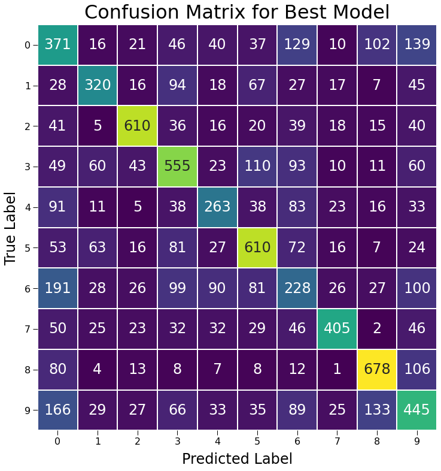
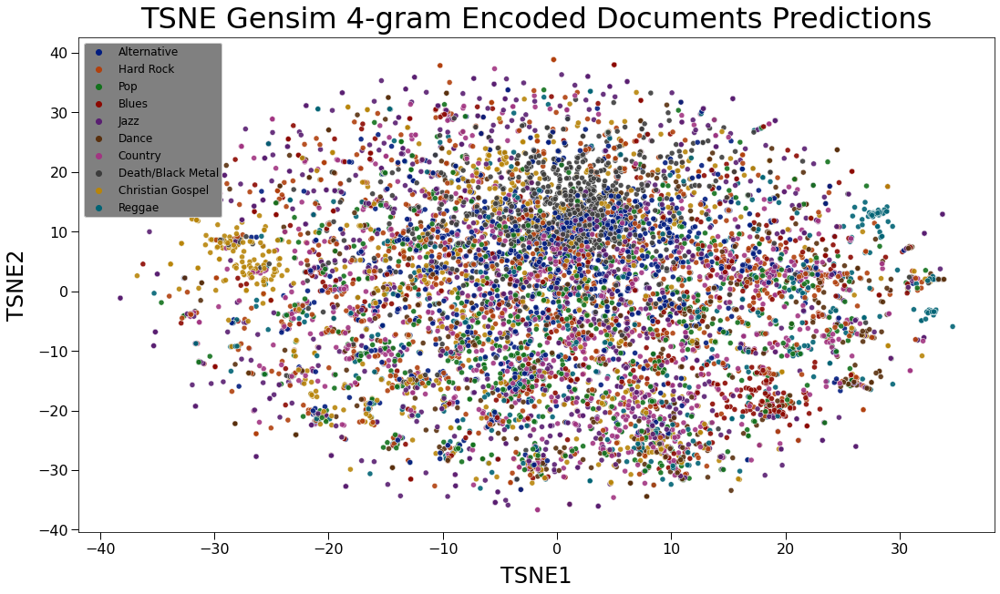

# Classifying Music Genres Based on Song Lyrics

**Author**: Joshua Gottlieb

## Overview and Business Problem

Classifying music genres is a difficult task. Genre labels are a useful metric to use to group certain types of songs together, but they also are a bit nebulous and inconsistent. Assigning a song to a genre is more of an art than a science, and acquiring accurate genre labels for songs frequently requires extensive expert analysis.

In this project, I wanted determine if it was possible to accurately assign genre labels to songs based only upon the lyrics present in the song. On the one hand, there are some genres with very generic lyrics, such as Pop, but on the other hand, there are some genres that exhibit unique themes in their songs, such as Death Metal. In theory, it should be possible to determine genre with some degree of accuracy using just NLP techniques on the song lyrics.

## Data Collection

All song metadata (title, artist, album, and genre) were pulled from [musiXmatch.com's developer API](https://developer.musixmatch.com/). This site was initially chosen because it touted having millions of song lyrics available. It turns out this is only partially true - a free API key allows the user to download roughly 30% of the lyrics for each song due to copyright reasons. I tried a few other APIs, but musiXmatch's API was still the best for retrieving song metadata, as it allowed me to query by genre, with flags set to match songs with lyrics specifically in English. Many of the other APIs had far less organization, and so I retrieved 10,000 song titles for each of 12 genres:

<ul>
    <li> Alternative </li>
    <li> Black/Death Metal </li>
    <li> Blues </li>
    <li> Christian Gospel </li>
    <li> Country </li>
    <li> Dance </li>
    <li> Hard Rock </li>
    <li> Jazz </li>
    <li> Hip Hop/Rap </li>
    <li> Pop </li>
    <li> R&amp;B/Soul </li>
    <li> Reggae </li>
</ul>

These genres were picked somewhat arbitrarily. I inspected the available genres from musiXmatch, as well as the genres/subgenres with large amounts of data available, and these genres were the ones which stood out the most. It should be noted that Christian Gospel contained Christian Rock underneath it, which is closer to the various rock genres than to gospel music, as far as I am concerned. I also did not apply any rules to prevent the acquisition of duplicates, if they appeared in multiple genres. The musiXmatch API has a limit of about 2,000 calls per day, meaning it took about 6 days the desired data.

Lyrics were scraped from [SongLyrics](https://www.songlyrics.com/) using [requests](https://requests.readthedocs.io/en/latest/) and [BeautifulSoup](https://beautiful-soup-4.readthedocs.io/en/latest/). Lyrics data was then stitched with the song metadata using artist/title pairs as the join keys, in preparation for cleaning. It should be noted that even when running the scraping operation on two machines simultaneously, it took roughly 3 days to scrape the data, due to interruptions caused by bad URL construction due to song titles that were formatted in an irregular manner. All raw data can be found in zipped format in [./data/raw].

## Data Cleaning

Processing my scraped song lyrics (each song will be called a document and the entire list of documents will be referenced as a corpus for the rest of this README) required some effort and careful thought. First, I had to trim the corpus for actual text preprocessing. Some documents had errors from scraping, these were dropped. Each document was split into a list of strings for further preprocessing. Then, any documents which did not actually contain song lyrics were dropped, which was possible since songlyrics.com has specific wording for songs for which they do not have lyrics.

Further preprocessing involved using a series of [RegEx](https://docs.python.org/3/library/re.html) transformations to remove leading phrases that were scraping artifacts, remove all non-alphabetic characters, remove all words (henceforth referred to as tokens) of 2 or fewer characters, and strip white spaces. Stop words from [NLTK's stopword list](https://pythonspot.com/nltk-stop-words/) were removed, and each document was converted to a list of tokens. Finally, each token was then lemmatized using [spaCy's core English pipeline](https://spacy.io/models/en). To see the full list of transformations used, see [the scraping module](./notebooks/project_functions/scraping.py).

After cleaning, duplicates were dropped, and all records for Hip Hop/Rap and R&B/Soul were dropped, as each genre had fewer than 3000 documents. The document distribution after cleaning was as follows:

| Genre Count                           |
| :-----------------------------------: |
|  |

To be used in models and other tests, it is necessary to vectorize each document in my corpus. I used a variety of different vectorization methods, including [SkLearn's CountVectorizer](https://scikit-learn.org/stable/modules/generated/sklearn.feature_extraction.text.CountVectorizer.html), n-gram encoding using [gensim's Phraser](https://radimrehurek.com/gensim/models/phrases.html), and averaged neural network encoding using [word2vec and glove](https://radimrehurek.com/gensim/models/word2vec.html) also from gensim. Note that I did not train a neural network myself, and so I simply used the pretrained models to vectorize each token, then averaged all tokens in the document to get vectorized documents, which is not the best method for using these pretrained neural networks but was something I could use in a shallow learning model.

## Topic Modeling and Data Exploration

Before throwing the data into some models, I decided to do some topic modeling to see if there was a natural representation of the genres that was different than the current labels that exist in my data set. Below are the results of the coherence score analysis that was performed.

| LDA Coherence Scores Across N-Topics                       |
| :--------------------------------------------------------: |
|                        |

As can be seen, the coherence scores are highest at 8 topics. Throwing this model into pyLDAvis gives:


| TSNE Gensim 4-Gram Encoded Train Set Ground-Truth Labels   |
| :--------------------------------------------------------: |
|           |


## Results

| Model Scores                                               |
| :--------------------------------------------------------: |
|                      |

| Best Model Confusion Matrix                                |
| :--------------------------------------------------------: |
|       |

| Best Model Classification Report                           |
| :--------------------------------------------------------: |
|  |

| TSNE Gensim 4-Gram Encoded Documents Test Predictions      |
| :--------------------------------------------------------: |
|            |

## Conclusions

In general, it is quite difficult to classify song genre's solely by lyrics. Some genres do exhibit unique vocabularies that allow them to be easily identified, while others are quite generic and fail to stand out. NLP is a powerful tool, but in the end, it is probably easier to classify song genre based on more musical qualities, such as instruments used, tempo/beat, musical key, and so on.

## Next Steps

Next steps include:
<ul>
    <li>Gather more data, as wrangling the musiXmatch API and web scraping produced limited results.</li>
    <li>Combine and drop genres in accordance with topic modeling and domain knowledge.</li>
    <li>Turn the problem on its head and see if there are songs which can be "genre-swapped" due to having lyrics which could be in multiple genres.</li>
</ul>

## For More Information

Please look at my full analysis in [Jupyter Notebooks](./notebooks), or in my [presentation](./presentation/Identifying_Exoplanets_Using_Machine_Learning.pdf), and code in the [Project Modules](./notebooks/project_functions).

For any additional questions, please contact: **Joshua Gottlieb (joshuadavidgottlieb@gmail.com)**

## Repository Structure

```
├── README.md                               <- The top-level README for reviewers of this project   
├── .gitignore                              <- Hidden file specifying which files to ignore
├── data                                    <- Folder containing external and code-generated data
│   ├── cleaned                             <- Folder containing cleaned data used by notebooks
│   │   ├── binary_class_data.parquet
│   │   ├── multi_class_data.parquet
│   │   ├── test_binary.parquet
│   │   ├── test_multi.parquet
│   │   ├── train_binary.parquet
│   │   └── train_multi.parquet
│   ├── models                              <- Folder containing pickled fitted models
│   │   ├── binary
│   │   │   ├── binary_adaboost.pickle
│   │   │   ├── binary_base_logistic.pickle
│   │   │   ├── binary_gradientboost.pickle
│   │   │   ├── binary_kneighbors.pickle
│   │   │   ├── binary_logistic.pickle
│   │   │   ├── binary_random_forest.pickle
│   │   │   ├── binary_tree.pickle
│   │   │   ├── binary_xgboost_class_0_recall.pickle
│   │   │   └── binary_xgboost.pickle
│   │   └── multi
│   │       ├── multi_adaboost.pickle
│   │       ├── multi_base_tree.pickle
│   │       ├── multi_gradientboost.pickle
│   │       ├── multi_kneighbors.pickle
│   │       ├── multi_random_forest.pickle
│   │       ├── multi_tree.pickle
│   │       ├── multi_xgboost_class_0_recall.pickle
│   │       └── multi_xgboost.pickle
│   └── raw                                    <- Folder containing raw files used by Data-Cleaning notebook
│       ├── column_names.md
│       ├── kepler_cumulative.csv
│       └── kepler_cumulative.csv.zip
├── notebooks                                  <- Folder containing Jupyter notebooks with project code
│   ├── Data-Cleaning.ipynb
│   ├── Data-Collection.ipynb
│   ├── EDA-and-Feature-Engineering.ipynb
│   ├── Modeling.ipynb
│   ├── packages                               <- Subfolder containing methods used between notebooks
│   │   ├── __init__.py
│   │   ├── model_evaluation.py
│   └── Visualizations.ipynb
├── images                                     <- Folder containing images generated from code and from external sources
│   ├── angular_offset_sky_boxplots.png
│   ├── base_binary_class_report.png
│   ├── base_binary_confusion_matrix.png
│   ├── base_multi_class_report.png
│   ├── base_multi_confusion_matrix.png
│   ├── best_binary_class_report.png
│   ├── best_binary_confusion_matrix.png
│   ├── best_binary_feature_importances.png
│   ├── best_multi_class_report.png
│   ├── best_multi_confusion_matrix.png
│   ├── best_multi_feature_importances.png
│   ├── max_multi_event_stat_boxplots.png
│   ├── orbital_period_boxplots.png
│   ├── orbit_semimajor_axis_boxplots.png
│   ├── planet_star_radius_ratio_boxplots.png
│   ├── transit_depth_boxplots.png
│   └── transit_method.png
├── presentation                               <- Folder containing PDF of presentation
│   └── Identifying_Exoplanets_Using_Machine_Learning.pdf
```
